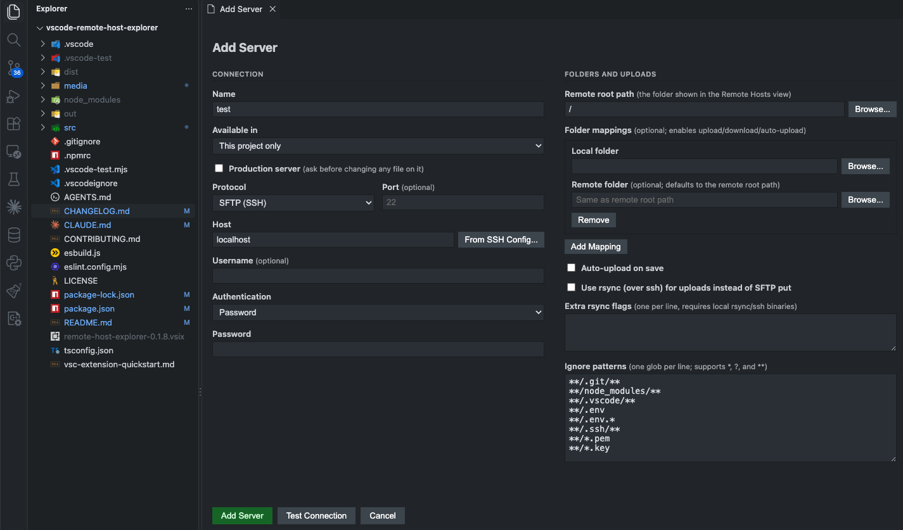

# Remote Host Explorer

Browse, edit, upload, and download files on your servers without leaving VS Code — a deployment
workflow in the spirit of PhpStorm's Remote Host tool. Works over **SFTP**, **FTPS**, and **FTP**.



## Features

- **Remote Hosts view** in the Activity Bar: browse server folders, open a file, edit it, and save to
  upload it back.
- **Safe saving**: if a file changed or was deleted on the server since you opened it, you're asked
  before anything is overwritten.
- **File operations**: create files and folders, rename, delete, copy, paste, back up, and move — for
  one item or many at once.
- **Upload and download** files and whole folders between your project and the server, including
  **upload on save** and dragging files in from your file manager. Folder transfers over SFTP send
  several files at once.
- **Compare** a local file with the server's copy side by side, or **sync** a whole folder: see what
  differs on each side and choose what to upload or download.
- **Production servers** are shown in red and ask before any file on them changes. Uploads warn when
  the server's copy changed since you last transferred it.
- **Upload Git changes** in one go, and see where saving uploads to in the status bar.
- **SSH terminal**: open a shell on an SFTP server, already in the folder you picked.
- **Project or global servers**: each project shows only its own servers, unless you make a server
  available everywhere.
- **Secure by default**: credentials in your system's secure storage, SSH host key checks, and
  certificate checks for FTPS. See [Security](#security).

## Getting started

1. Open your project folder in VS Code. If asked, choose **Trust** — the extension only runs in
   trusted folders.
2. Click the **Remote Host Explorer** icon in the Activity Bar, then **Add Server...**.
3. Fill in the form:
   - **Available in** — *This project only* (default) or *All projects*.
   - **Production server** — tick it for a live site: every change to its files asks first.
   - **Protocol** — SFTP, FTPS, or FTP; then the host, port, and username. For SFTP, **From SSH
     Config...** fills these in (and the key) from a host in your `~/.ssh/config`.
   - **Authentication** — a password, or for SFTP a private key file or your SSH agent. The key path
     starts as `~/.ssh/id_rsa`; change it if your key has another name, such as `~/.ssh/id_ed25519`.
   - **Remote root path** — the server folder to show. **Browse...** lets you pick it.
   - **Folder mappings** — optional, but needed for uploading and downloading to your project. Each
     mapping links a **Local folder** (usually your project folder) to a **Remote folder** on the
     server; leave the remote folder empty when it's the remote root path. **Add Mapping** adds more.
4. Click **Test Connection**, then **Add Server**.
5. Click the plug icon next to the server to connect, then expand it to browse.

The first time you connect to an SFTP server, VS Code shows the server's key fingerprint. Accept it if
it matches what your hosting provider or administrator gives you.

## Using the Remote Hosts view

- **Open a file** by clicking it. Saving uploads your changes.
- **Right-click** a file, folder, or server for all actions.
- **Select several items** with `Cmd`-click / `Ctrl`-click or `Shift`-click to delete, copy, back up, or
  download them together.
- **Download to Folder...** saves items into any folder you choose, whether or not the server has a
  folder mapping.
- **Create** files and folders with **New File...** and **New Folder...** on a folder or the server.
- **Move items** by dragging them onto a folder, or with **Cut** then **Paste**.
- **Upload by dragging** files or folders from Finder, File Explorer, or VS Code's Explorer onto a folder
  in the view. If an item with the same name already exists, you choose **Replace** or **Skip**.
- **Open SSH Terminal** on an SFTP server or folder opens a shell in VS Code's terminal, in that folder.
  It uses the extension's connection, so you don't log in again and nothing needs to be installed.
- **Lost connections** are picked up again: if a connected server drops (for example after sleep or a
  network change), its dot turns yellow and the next action — expanding a folder, opening a file,
  uploading — reconnects.
- **Keyboard shortcuts** (while the view is focused):

  | Action | Windows / Linux | macOS |
  | --- | --- | --- |
  | Copy | `Ctrl+C` | `Cmd+C` |
  | Cut | `Ctrl+X` | `Cmd+X` |
  | Paste | `Ctrl+V` | `Cmd+V` |
  | Delete | `Delete` | `Cmd+Backspace` |

- **Create Backup** makes a timestamped copy next to the file, such as `index_2026-09-13_142501.php`.
- **Change Permissions...** sets permissions on the selected files and folders, as `644` or
  `rw-r--r--`. Hover over a file to see its current permissions. Over FTP this works when the server
  supports `SITE CHMOD`, as most do.
- **Reveal in Remote Hosts** on a file in the Explorer (or an editor tab) selects its copy in this view,
  connecting if needed.
- **Duplicate Server...** on a server opens the form pre-filled with a copy, so you can add the same
  server with different folders. Leave the password blank to reuse the original's; it is only reused
  while the protocol, host, port, and username stay the same.

## Uploading and downloading

Uploading, downloading to your project, and Compare need a **folder mapping** on the server. A mapping
links a folder on your computer to a folder on the server — by default the remote root path — so
`my-project/app/index.php` maps to `/var/www/app/index.php`.

To browse more of the server than you map, set the mapping's **Remote folder**. A server can have
several mappings. For example, to see a whole WordPress install but work only on your theme and one
plugin:

| Field | Value |
| --- | --- |
| Remote root path | `/var/www/site` |
| Mapping 1 | `~/projects/my-theme` ↔ `/var/www/site/wp-content/themes/my-theme` |
| Mapping 2 | `~/projects/my-plugin` ↔ `/var/www/site/wp-content/plugins/my-plugin` |

The Remote Hosts view then shows all of `/var/www/site`, while uploads, downloads, Compare, and upload
on save use only the mapped folders. If mapped folders are nested, the innermost one is used.

- **Upload**: right-click files or folders in the Explorer and choose **Upload to Remote Host**. It is
  greyed out for items outside every mapped local folder.
- **Several servers for one folder** (for example dev and prod): uploading asks which server to use,
  every time, from a list that shows where each would put the files. With one server, it uploads
  right away. **Compare with Remote**, **Sync**, and **Reveal** ask the same way.
- **Upload on save**: turn on **Auto-upload on save** for the server. If several servers map the file,
  each one with auto-upload turned on receives it. For a file in a mapped folder, the status bar shows
  where saving uploads to (for example `dev`) or **Auto-upload off**; click it to choose.
- **Upload Git changes**: **Upload Git Changes to Remote Host...** in the Source Control view's `…`
  menu (or the Command Palette) lists every file Git shows as added or modified, lets you untick any,
  and uploads the rest. Ignore patterns apply; deleted files are not removed from the server.
- **Changed on the server?** Before an upload replaces a file, the extension checks whether the
  server's copy changed since it last uploaded or downloaded that file — a hotfix made directly on the
  server, for example. If so, you choose **Overwrite** or **Skip** (or either for all). Files it has
  never transferred are uploaded without this check.
- **Download**: right-click items in the Remote Hosts view and choose **Download to Local** to download
  them into their mapped local folder. It is greyed out for items outside every mapped server folder.
- **Download anywhere**: choose **Download to Folder...** instead and pick a folder. This works for any
  item, with or without a mapping.
- **Existing local files are never replaced silently.** If a download would overwrite a file on your
  computer, you choose **Overwrite**, **Skip**, or apply either to all remaining files. For a folder,
  all of these questions come first, before any file is transferred.
- **Compare**: right-click a file in the Explorer and choose **Compare with Remote**, or a file in the
  Remote Hosts view and choose **Compare with Local**. The server's copy opens read-only on the left.
- **Large transfers** show progress and can be cancelled. Over SFTP, up to four files in a folder are
  transferred at the same time; FTP sends one file at a time.
- **Transfers panel**: every upload, download, and copy in this window is listed in the **Transfers**
  tab of the bottom panel. Expand one to see each file as `from → to`, including files that were
  ignored, kept, or failed. Click a file to open your local copy. The **Show Transfers** button on a
  finished transfer's notification opens the panel.

### Production servers

Tick **Production server** in the server form for a live site. Its name is shown in red with a **P**,
and uploading, saving, deleting, moving, renaming, creating files, pasting, and changing permissions on
it all ask first. For saving and upload on save, you can choose **Continue, Don't Ask Again Until
Reload**.

### Syncing a folder

Right-click a folder in the Explorer and choose **Sync with Remote Host...**, a folder in the Remote
Hosts view and choose **Sync with Local Folder...**, or a server and choose **Sync with Server...**. The
extension compares both sides and lists every file that differs:

- **Upload to the server** — new or changed on your computer (ticked).
- **Download from the server** — only on the server, or changed there (ticked).
- **Needs your decision** — changed on both sides, or different and never synced by the extension.
  Nothing is ticked; pick upload *or* download.

Press Enter to transfer what's ticked. Ignore patterns apply to both sides, and nothing is ever
deleted. Changes are detected against the extension's own record of each transfer, so files it has
never transferred are compared by size only.

### Ignore patterns

Ignore patterns keep files from being uploaded on save or included in folder uploads and downloads.
New servers start with:

```text
**/.git/**        **/node_modules/**   **/.vscode/**
**/.env           **/.env.*            **/.ssh/**
**/*.pem          **/*.key
```

These keep version control data, dependencies, editor settings, environment files, and keys off your
server. Edit them in the server form, one pattern per line. `*` matches within a folder name, `**`
matches any number of folders, and `?` matches one character.

A file you upload explicitly — by right-clicking it — is uploaded even if it matches a pattern.

### Faster uploads with rsync (SFTP only)

Turn on **Use rsync for uploads** to upload with `rsync` over SSH, which is faster for many files.
Browsing and downloading still use SFTP. This is the only feature that needs extra software on your
computer:

| | Windows | macOS | Linux |
| --- | --- | --- | --- |
| `rsync` | Install via WSL, Git for Windows, MSYS2, or Cygwin | Included; newer via `brew install rsync` | Usually included; else `apt install rsync` |
| `ssh` | Included in Windows 10 and later | Included | Usually included; else `apt install openssh-client` |

rsync can't answer password prompts, so the server must accept your SSH key without one.

## Project and global servers

| Available in | Saved in | Appears |
| --- | --- | --- |
| **This project only** | The project's `.vscode/remote-hosts.json` | Only when that project is open |
| **All projects** | Your VS Code user settings | In every window, marked `global` |

To change a server's scope, edit it and change **Available in**. Hover over a server to see its scope
and folder mappings.

`.vscode/remote-hosts.json` contains server names, hosts, usernames, and paths — never passwords. If
you commit it, teammates get the same server list and enter their own credentials. If you don't want
that, add `.vscode/remote-hosts.json` to `.gitignore`. Your other VS Code settings stay unaffected.

If several folders are open, a new server is saved in the folder that contains its first mapped local
folder, or in the first folder otherwise.

Servers saved by earlier versions in `.vscode/settings.json`, a `.code-workspace` file, or the old
`remoteHostViewer.servers` setting are moved to their new place automatically, together with their
saved passwords.

## Security

- **Passwords and key passphrases** are stored in your operating system's secure credential storage
  (macOS Keychain, Windows Credential Manager, or the Linux keyring). They are never written to
  settings files and never synced by Settings Sync. Removing a server deletes them.
- **Private keys** stay where they are. Only the file's path is saved; the key is read when you
  connect and is never copied or uploaded.
- **SSH host keys** are remembered the first time you connect. If a server's key later changes, you
  get a prominent warning, because that can mean the connection is being intercepted.
- **FTPS** checks the server's TLS certificate and refuses invalid or self-signed ones. Port 990 uses
  implicit TLS; any other port uses explicit TLS (AUTH TLS).
- **SSH agent** authentication uses the keys your agent holds; the extension never sees or stores them.
- **FTP** sends your password and files **unencrypted**. The form warns you when you select it. Use
  SFTP or FTPS whenever the server supports them.
- **Saved credentials stay with their server.** If you change the protocol, host, port, or username in
  the form, the saved password is not used — you'll need to enter it again.
- **Trusted folders only.** The extension is disabled in Restricted Mode, because a project's
  `.vscode/remote-hosts.json` can define servers and upload destinations.
- **What can leave your computer:**
  - With Settings Sync on, **All projects** servers sync to your account — names, hosts, usernames,
    and paths, but never credentials.
  - If you commit `.vscode/remote-hosts.json`, **This project only** servers are shared with your
    repository.
- **Local copies**: files you open from a server are downloaded to VS Code's storage for this
  extension so you can edit them. They stay on your computer until you remove them.
- **Transfer records**: to notice changes on the server, the extension remembers the size and
  modification time of files it uploaded or downloaded (never their contents), in its own storage.

## Settings reference

**All projects** servers are saved in the `remoteHostExplorer.servers` user setting, and **This project
only** servers in the project's `.vscode/remote-hosts.json`:

```jsonc
{
  "servers": [
    { "id": "staging", "name": "Staging", "protocol": "sftp", "host": "staging.example.com", "remoteRoot": "/var/www" }
  ]
}
```

Using the form is recommended; you can also edit the JSON directly, and VS Code suggests the fields as
you type. Each server needs a unique `id`, which its saved password is linked to.

| Field | Description |
| --- | --- |
| `name` | Name shown in the Remote Hosts view. |
| `protocol` | `sftp`, `ftps`, or `ftp`. |
| `host`, `port` | Server address. The port defaults to `22` for SFTP and `21` for FTP and FTPS. |
| `username` | Login name. |
| `privateKeyPath` | SFTP only. Path to a private key file; when set, key authentication is used. `~` is your home folder. |
| `useSshAgent` | SFTP only. Authenticate with the keys loaded in your SSH agent. |
| `remoteRoot` | Server folder shown as the root. |
| `mappings` | List of folder mappings, each `{ "localPath": "…", "remotePath": "…" }`. `remotePath` defaults to `remoteRoot`. Needed for uploads and downloads to your project. |
| `localPath`, `remoteMappedPath` | A single mapping, as saved by earlier versions. Still honoured; saving the server in the form turns it into `mappings`. |
| `autoUpload` | Upload files inside a mapped local folder when you save them. |
| `production` | A live server: changes to its files ask for confirmation first, and it is shown in red. |
| `ignoreGlobs` | Patterns to skip. If omitted, the defaults above apply. Use `[]` to skip nothing. |
| `useRsyncForUpload` | SFTP only. Upload with `rsync` over SSH. |
| `rsyncOptions` | Extra `rsync` options, one per line in the form. |

Passwords and passphrases are not settings; enter them in the form.

## Troubleshooting

The **Transfers** panel shows where each file went. Details of errors are written to **View → Output →
Remote Host Explorer**.

**The Remote Hosts view is empty or does nothing.**
Make sure the folder is trusted: run **Workspaces: Manage Workspace Trust** from the Command Palette.

**"Couldn't read .vscode/remote-hosts.json in "…": …"**
The file isn't valid JSON, so its servers aren't shown. The message names the problem and its line.
Until it is fixed, saving a server to that project fails with ".vscode/remote-hosts.json in "…" can't
be read" — the extension won't overwrite a file it can't read.

**"Couldn't move saved servers to their new location: …"**
Servers from an earlier version couldn't be moved into `.vscode/remote-hosts.json`, often because that
file can't be read. They stay where they were, so nothing is lost; fix the problem and reload the window.

**A server I added in another project doesn't show up.**
It was saved as *This project only*. Open that project, edit the server, and set **Available in** to
**All projects**.

**"The authenticity of host … can't be established."**
Normal the first time you connect to an SFTP server. Compare the fingerprint with the one from your
hosting provider, then choose **Connect and Remember**.

**"REMOTE HOST IDENTIFICATION HAS CHANGED"**
The server presented a different key than last time. If your provider rebuilt or migrated the server,
choose **Trust the New Key**. If you don't know why it changed, don't connect — ask your provider.

**FTPS fails with "self-signed certificate".**
The server's certificate isn't trusted, so the connection is refused on purpose. Use SFTP if the
server supports it, or ask your hosting provider for a valid certificate.

**"No SSH agent was found: SSH_AUTH_SOCK is not set …"**
The server uses SSH agent authentication, but VS Code wasn't started with access to an agent. Start
`ssh-agent`, add your key with `ssh-add`, and restart VS Code. On Windows, start the **OpenSSH
Authentication Agent** service. Or switch the server to private key authentication.

**"Could not read the private key at …"**
Check that the path in **Private key path** exists and that your user can read the file.

**"Download to Local" is greyed out.**
The item is outside every mapped server folder. Edit the server and add a folder mapping that covers
it, or use **Download to Folder...** to save it anywhere.

**"Upload to Remote Host" is greyed out in the Explorer.**
The item is outside every mapped local folder. Edit the server and add a folder mapping for it. A
folder created outside VS Code becomes available about a second later.

**A file wasn't uploaded on save.**
Check that **Auto-upload on save** is on for the server, the file is inside its local folder, and it
doesn't match an ignore pattern. The Output panel records skipped files.

**"… changed on … since you last uploaded or downloaded it."**
Someone (or something) changed that file on the server after the extension last transferred it.
Choose **Skip** to keep the server's copy, then compare it with **Compare with Remote** before
deciding; or **Overwrite** to upload yours anyway.

**"… is a production server."**
The server is marked as production, so every change to its files asks first. To stop the questions,
edit the server and untick **Production server**.

**"… connects through ProxyJump or ProxyCommand, which Remote Host Explorer can't use; the connection
may fail."**
The SSH config host reaches the server through a jump host. Connect to the server directly, or use a
host that doesn't need a jump.

**"The Transfers panel appears after VS Code reloads the window."**
The extension was just updated and VS Code hasn't loaded the new panel yet. Choose **Reload Window**,
or restart VS Code.

**"rsync was not found on PATH" or "rsync exited with code …"**
Install `rsync` (see the table above), or turn off **Use rsync for uploads**. For exit errors, check
that `ssh` can log in to the server with your key without asking for a password.

## Requirements

- VS Code **1.90** or later.
- Windows, macOS, or Linux.
- Access to an SFTP, FTPS, or FTP server.
- Everything else is built into the extension; only the optional rsync feature needs extra software.

## Known limitations

- Copying or moving between two different servers isn't supported.
- Sync never deletes files, on either side. Change Permissions applies to the selected items only, not
  to what's inside a folder.
- **From SSH Config...** reads `Host` entries (including `Include`d files) but can't use `ProxyJump`,
  `ProxyCommand`, or `Match` blocks. Pageant isn't supported; on Windows use the OpenSSH
  Authentication Agent.
- Implicit FTPS is only used on port 990.
- Some FTP servers don't report when a file was modified. With those, the extension can't warn you
  that a file changed on the server before you save over it or upload over it.
- FTP transfers use a second connection so you can keep browsing. Servers that allow only one
  connection per user still work, but browsing then waits while a transfer is running.
- Folder uploads through rsync don't check whether files changed on the server.
- Rename uses an input box rather than editing the name in place.
- Items can't be dragged from the Remote Hosts view into VS Code's Explorer, because the Explorer
  doesn't accept drops from other views. Use **Download to Folder...** instead.
- In Remote-SSH, WSL, and Dev Container windows, the extension runs on your own computer, so a mapped
  **Local folder** is a folder on your computer.

## License

[MIT](LICENSE)
